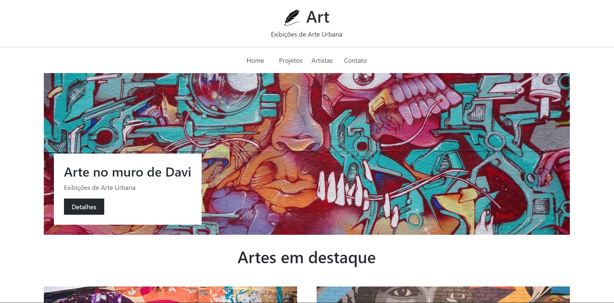

<h1 align="center"> Art </h1>

    Projeto Art. 

  <a href="#-tecnologias">Tecnologias</a>&nbsp;&nbsp;&nbsp;|&nbsp;&nbsp;&nbsp;
  <a href="#-projeto">Projeto</a>&nbsp;&nbsp;&nbsp;|&nbsp;&nbsp;&nbsp;
  <a href="#-layout">Layout</a>&nbsp;&nbsp;&nbsp;|&nbsp;&nbsp;&nbsp;
  <a href="#memo-licença">Licença</a>

  

 

  

## 🚀 Tecnologias

Esse projeto foi desenvolvido com as seguintes tecnologias:

- HTML e CSS
- Bootstrap 5.3.0-alpha3
- JavaScript
- Git e Github

## 💻 Projeto

O projeto Art é um projeto elaborado com o fim de estudo e pratica de tecnologias citadas.

- [Acesse o projeto finalizado, online](https://github.com/marcioaquilles/projeto_art)

## 🔖 Layout

Layout desenvolvido baseado em conteúdo de terceiros.

## 📜  Licença

Esse projeto está sob a licença MIT.

---

Feito por Márcio Aquilles.